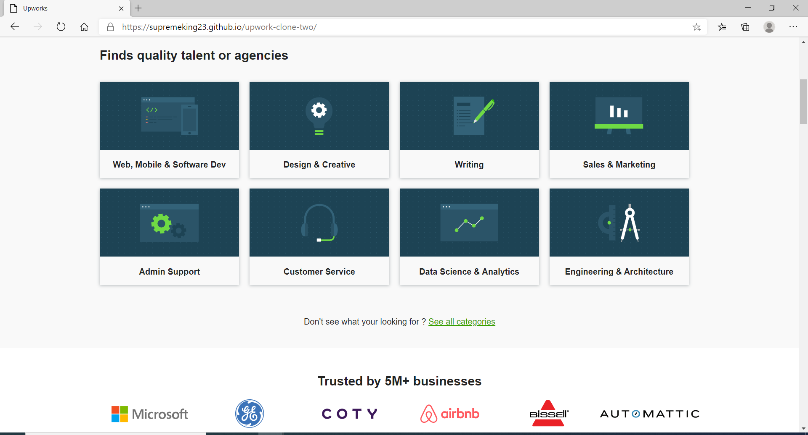
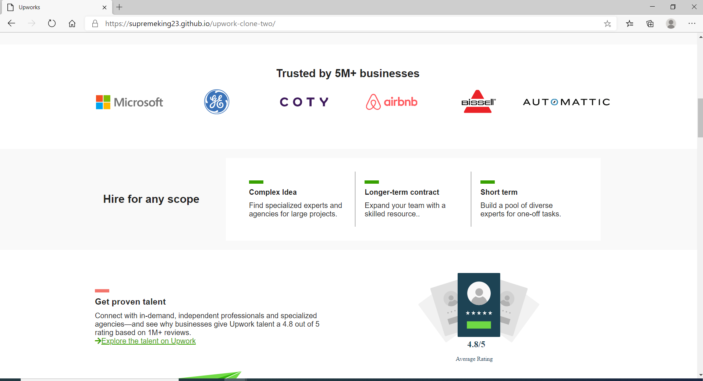
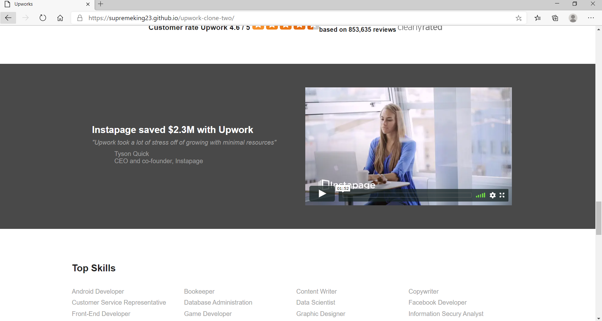
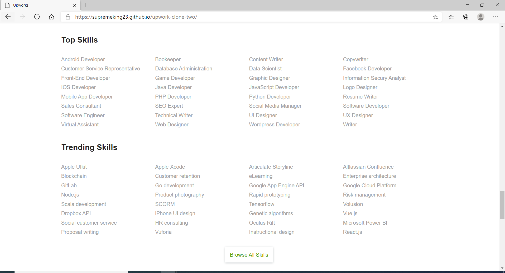
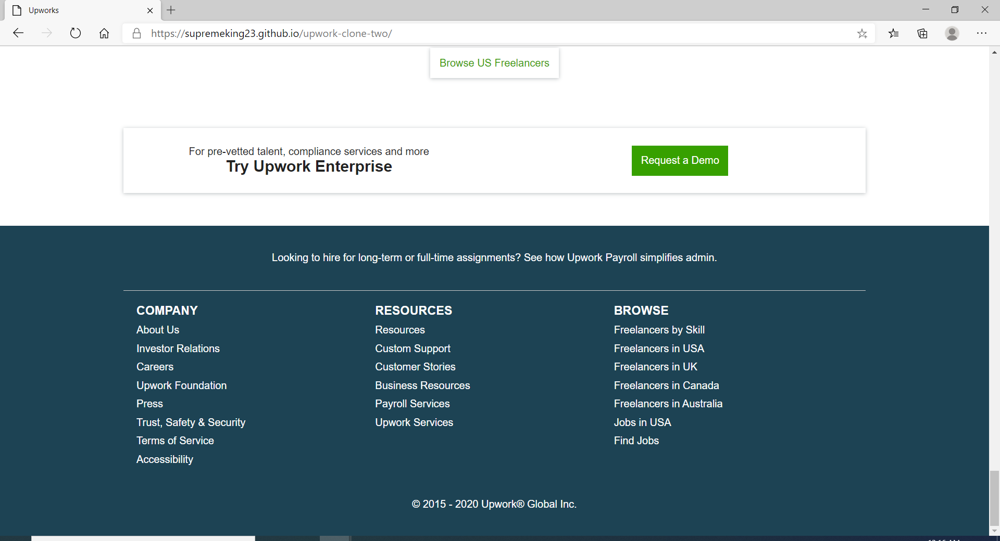

# Upwork Clone

[comment]: <> (a reference style link.)
Link: https://supremeking23.github.io/upwork-clone-two/

**Upwork** Upwork, formerly Elance-oDesk, is an American freelancing platform where enterprises and individuals connect in order to conduct business. In 2015, the Elance-oDesk merger was rebranded as Upwork and the company's full name is now Upwork Global Inc.. 

## Insperation
__Upwork Clone__ is based on __*Upwork.com*__ [Views of the Solar System](www.upwork.com) 

## Tech 

Solar System View uses a number of technology to work properly:

* HTML5
* CSS3

## Developer
* Ivan Christian Jay E. Funcion

## Screenshots

